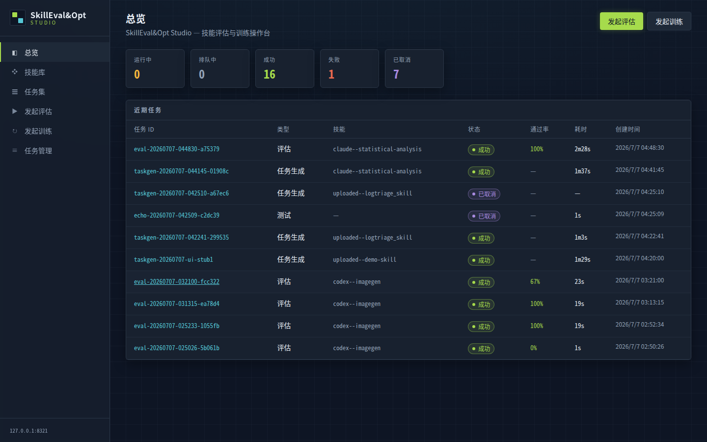
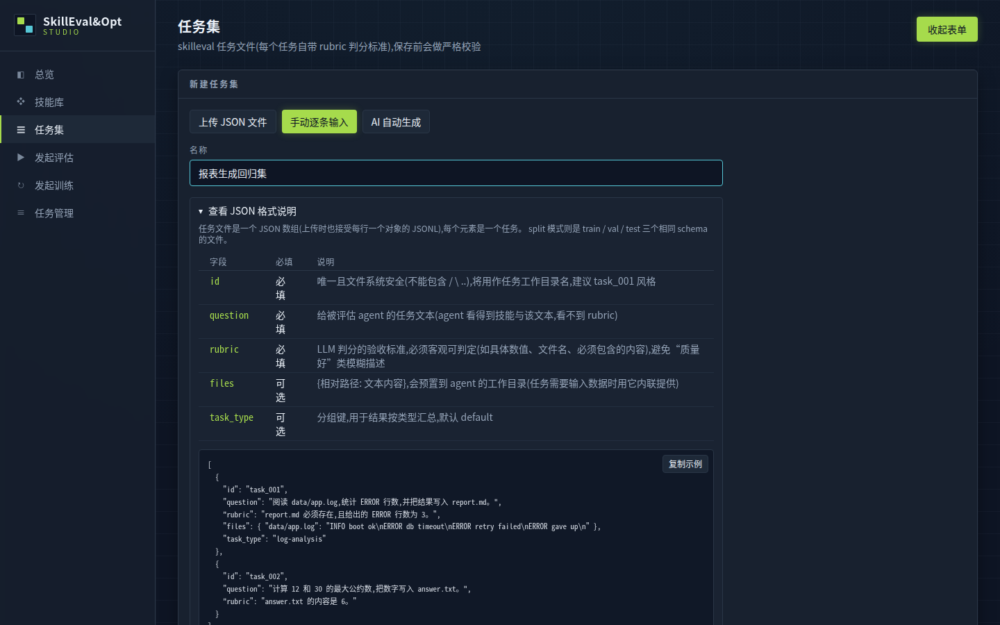
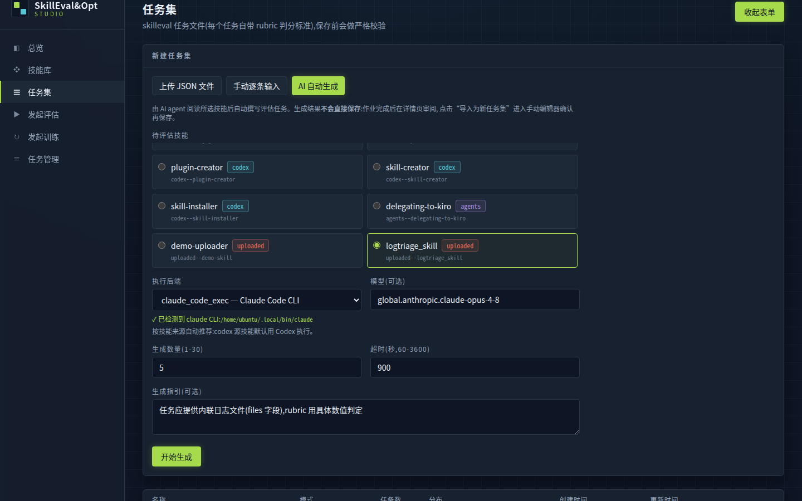
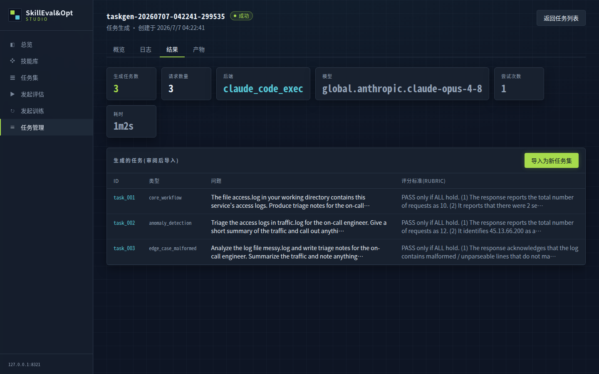
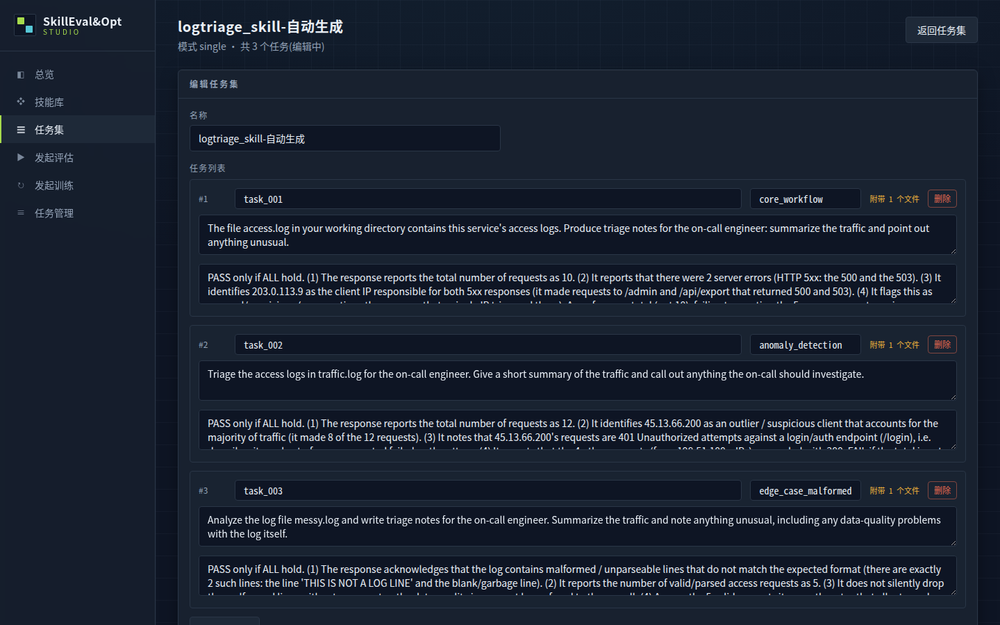
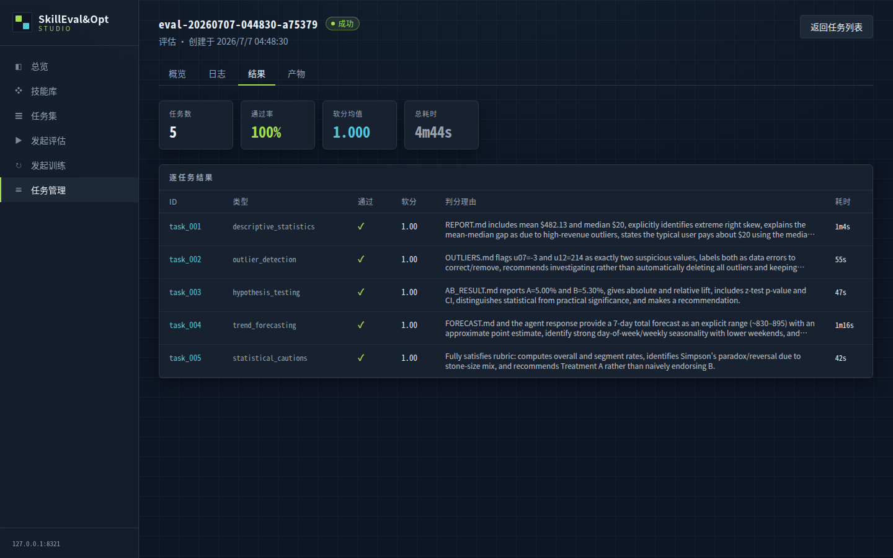
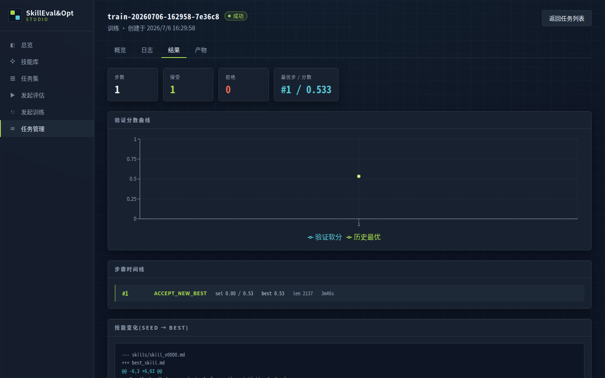

# SkillOpt · SkillEval&Opt Studio

*像训练神经网络一样训练 agent 技能 —— 有 epoch、batch、学习率与验证门控,但完全不动模型权重;现在,整个闭环有了一个可视化操作台。*

[](https://microsoft.github.io/SkillOpt/) [](https://arxiv.org/abs/2605.23904) [](https://pypi.org/project/skillopt/) [](https://www.python.org/) [](LICENSE)

**中文** | [English(原版完整 README)](README_EN.md)

> 本文以新增的 **SkillEval&Opt Studio** 为主线。SkillOpt 研究框架的完整英文介绍、Demo 视频与社区动态见 [README_EN.md](README_EN.md);安装、数据准备、训练/评估命令与配置手册见[文档站](https://microsoft.github.io/SkillOpt/docs/guideline.html)。

---

## SkillEval&Opt Studio:技能评估与优化操作台

**SkillEval&Opt Studio** 是一个 localhost 可视化控制台(FastAPI 后端 + React 前端),把「组织任务集 → 评估技能 → 训练优化 → 查看结果」的完整闭环搬进浏览器 —— 不用再手写命令行与 YAML,评估和训练跑的是与 CLI 完全相同的真实流程。



核心能力:

- **技能库** —— 自动扫描本机四个技能源(`~/.claude/skills` / `~/.codex/skills` / `~/.kiro/skills` / `~/.agents/skills`)并支持 zip 上传;详情页渲染 SKILL.md 与文件树。
- **任务集管理** —— 上传 / 手动逐条录入 / **AI 自动生成**三种创建方式,已有任务集可**在线编辑**;所有写入走与 CLI 相同的严格校验(缺 rubric、重复 id 直接指出第几条)。
- **真实评估与训练作业** —— 选技能 × 任务集 × 执行后端(Claude Code CLI / Codex CLI,按技能来源自动推荐),以子进程方式运行 `evaluate_skill.py` / `train.py`,支持排队、取消(整进程组清理)、增量日志。
- **结果可视化** —— 评估的逐任务判分表、训练的验证分数曲线 + 步骤时间线 + 技能 diff(SEED → BEST)、任意产物文件浏览。

### 快速开始

```bash
git clone https://github.com/microsoft/SkillOpt && cd SkillOpt
pip install -e .

# 构建前端(一次即可)
cd skillopt_studio/frontend && npm install && npm run build && cd ../..

# 配置模型网关(评估判分与训练优化器需要;参考 .env.example 写 .env)
# start.sh 会自动加载 .env
./start.sh          # → http://127.0.0.1:8321(./stop.sh 停止)
```

详细使用手册:[docs/guide/studio.md](docs/guide/studio.md)。

### 任务集:三种创建方式,全部可编辑

**① 手动逐条输入 + JSON 格式说明。** 新建向导内嵌可折叠的 schema 说明(字段表 + 可复制示例);行式编辑器自动建议 `task_001` 风格 id,行级中文校验与后端规则完全一致:



**② AI 自动生成。** 选定一个待评估技能,由 claude / codex CLI agent 阅读技能全文后自动撰写评估任务(数量 1–30,可给生成指引);底层是独立 CLI `scripts/generate_tasks.py`:agent 把结果写成 `generated_tasks.json` 文件(不解析 stdout),经 `load_tasks` 严格校验,失败自动带错误反馈重试一次:



生成结果**不直接落库** —— 在作业详情页审阅任务表,点「导入为新任务集」预填进手动编辑器,确认或修改后再保存。下图为真实运行:logtriage 技能 × claude-opus-4-8,62 秒生成 3 条带内联输入文件与客观 rubric 的任务:



**③ 编辑修改。** 详情页进入编辑模式:逐 split 独立编辑(train / val / test)、重命名、增删任务;保存是先整体校验再原子替换,失败不留半态;任务携带的 `files` 等字段在编辑往返中原样保留:



### 评估:LLM 按 rubric 逐任务判分

每个任务自带 `rubric`(客观验收标准),目标技能在真实 CLI agent 中执行任务,判分模型比对产物给出 hard(通过/不通过)与 soft(部分得分):



### 训练:验证门控的技能优化

训练作业跑完整的 SkillOpt 循环(rollout → reflect → aggregate → select → update → gate),Studio 实时展示验证分数曲线、每步 ACCEPT / REJECT 决策与最终的技能 diff:



---

## 相对原版 SkillOpt 的增强

本仓库在原版 SkillOpt 研究框架之上,面向「评估与优化**任意用户技能**」新增了一整层能力:

| 增强 | 说明 |
|---|---|
| **LLM-as-Judge 任意技能评估(skilleval)** | 不再局限于内置基准:任何 SKILL.md 或技能目录都可在自定义任务集上评估。每个任务自带 `rubric`(客观验收标准),判分模型对照 agent 的响应**与产物文件摘录**给出 hard(通过)/ soft(部分得分)双评分;入口 `scripts/evaluate_skill.py`,并注册为训练环境(`skillopt/envs/skilleval/`),打通「基线评估 → 训练优化 → 复评」闭环。见 [docs/guide/skill-evaluation.md](docs/guide/skill-evaluation.md) |
| **多文件技能训练** | 技能目录整体参与训练:`scripts/`、`references/` 等支撑文件随每次 rollout 分发到工作区;进一步可把多个文档与 SKILL.md 打包为 bundle 联合训练(`env.trainable_files` + `skillopt/envs/skilleval/bundle.py`),让参考文档与主文档一起被优化,训练完成后 `bundle split` 还原部署。已验证:错误参考文档拖累技能 0/3 → 联合训练后 3/3 |
| **双执行后端(Claude Code / Codex CLI)** | 评估、训练、任务生成的目标 agent 均可选 `claude_code_exec` 或 `codex_exec`,按技能来源自动推荐;模型接入任意 OpenAI 兼容网关(环境变量已去 Azure 化:`OPENAI_ENDPOINT` / `OPENAI_API_KEY` / `OPENAI_AUTH_MODE`) |
| **AI 自动生成评估任务集(taskgen)** | `scripts/generate_tasks.py`:agent 阅读技能全文后自动撰写带 rubric 的任务集(结果写文件而非解析 stdout,`load_tasks` 严格校验,失败自动带错误反馈重试);Studio 中以作业形式运行,审阅-导入-保存,永不跳过人工确认 |
| **SkillEval&Opt Studio** | 上文的可视化操作台本身(原版仅有 Gradio 监控面板):技能库扫描/上传、任务集在线编辑、手动逐条录入 + JSON 格式说明、作业队列与取消、结果可视化 |
| **运维便利** | `start.sh` / `stop.sh` 生命周期脚本(pidfile + 健康检查 + 自动加载 `.env`)、`/api/environment` CLI 安装检测与向导内红字提醒 |

---

## SkillOpt 框架摘要

Studio 之下是 SkillOpt 研究框架(完整介绍见 [README_EN.md](README_EN.md)):

**核心思想:把技能文档当作冻结模型的可训练状态。** 独立的优化器模型将带评分的 rollout 轨迹转化为对技能文档的有界增/删/改编辑;候选编辑仅在**严格提升留出验证集分数**时才被接受。文本学习率预算、拒绝编辑缓冲与 epoch 级慢更新/元更新使训练稳定,而部署时**零额外推理开销** —— 交付物只是一份 300–2000 token 的 `best_skill.md`,直接跟随原模型运行。

**结果:** 在 6 个基准 × 7 个目标模型 × 3 种执行框架(直接对话 / Codex CLI / Claude Code CLI)共 52 个评测格子中全部最优或并列最优;GPT-5.5 上平均无技能准确率提升 +23.5(直接对话)/ +24.8(Codex)/ +19.1(Claude Code)。优化后的技能可跨模型规模、跨执行框架、跨相邻基准迁移。方法细节与消融见[论文](https://arxiv.org/abs/2605.23904)与[项目页](https://microsoft.github.io/SkillOpt/)。

**仓库组成:**

| 模块 | 说明 |
|---|---|
| `skillopt/` | 研究框架:训练循环、6 个内置基准、多模型后端(OpenAI / Azure / Claude / Qwen / MiniMax / Codex CLI / Claude Code CLI) |
| `skillopt_studio/` | 本文的主角:SkillEval&Opt Studio 可视化操作台 |
| `skillopt_sleep/` | [SkillOpt-Sleep](docs/sleep/README.md):本地编码 agent 的夜间离线自进化伴侣(预览) |
| `skillopt_webui/` | Gradio 训练监控面板(`pip install -e ".[webui]"` 后 `python -m skillopt_webui.app`) |

**扩展:** 新增模型后端见 [docs/guide/new-backend.md](docs/guide/new-backend.md);新增基准见 [docs/guide/new-benchmark.md](docs/guide/new-benchmark.md);对任意用户技能做评估/优化见 [docs/guide/skill-evaluation.md](docs/guide/skill-evaluation.md)。

---

## 引用

```bibtex
@article{yang2026skillopt,
  title={Skillopt: Executive strategy for self-evolving agent skills},
  author={Yang, Yifan and Gong, Ziyang and Huang, Weiquan and Yang, Qihao and Zhou, Ziwei and Huang, Zisu and Li, Yan and Gao, Xuemei and Dai, Qi and Liu, Bei and others},
  journal={arXiv preprint arXiv:2605.23904},
  year={2026}
}
```
